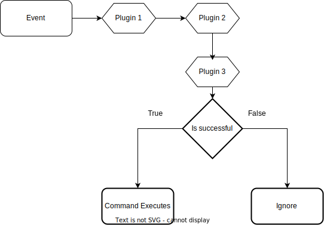

# Plugins

:::tip
TLDR: Plugins help reduce code repetition and are installable via `sern plugins`. Put them onto the plugins field of a command/event module. 
:::

## Installing 
Chances are, you just want your bot to work. Plugins can preprocess and create reusable conditions for modules.

run: 
```sh
sern plugins
```
- Install your favorite(s) (or the ones that look the coolest). In my imaginary mind, I installed the ownerOnly plugin. 
    - This should install in `plugins` directory in `src`.
- Some plugins only work with specific types. Most are targeted towards slash / both modules.
- Add to your module. 

```ts 
import { commandModule, CommandType } from '@sern/handler'
import { ownerOnly } from '../plugins'

export default commandModule({ 
    type: CommandType.Both,
    plugins: [ownerOnly(['182326315813306368'])],
    description: 'ping command',
    execute: (ctx) => {
        ctx.reply('hello, owner');
    }
})

```
#### ┗|｀O′|┛ perfect, your first plugin!

## Creating your own plugins

The controller determines in plugins whether to continue or fail.

### The controller object
```typescript
export interface Controller {
  next: () => Ok<void>;
  stop: () => Err<void>;
}
```
## Init Plugins
Init plugins modify how commands are loaded or do preprocessing.
An instance of the above object is passed into every plugin. <br />
This controls whether a module is stored into sern. <br />

```typescript
import { CommandInitPlugin } from '@sern/handler'
import path from 'path'
export const inDir = (dir: string) => {
    return CommandInitPlugin(({ module, absPath }) => {
       if(path.dirname(absPath) !== dir) {
          console.log(+new Date(),  `${module.name} is not in the correct directory!`);
          return controller.stop()
       }
       console.log(+new Date(),  `${module.name} is in the correct directory!`);
       return controller.next(); //continue
    });
}

```

Above, this simple plugin logs that the module has been loaded along with a timestamp. <br />

## Event Plugins
 <br />
- An event is emitted by discord.js.
- This event is passed to all plugins (**in order!!**),
- If all are successful,

The command is executed. Calling `controller.stop()` notifies sern that this command should not be run,
and command is ignored.

Can you predict the behavior of this command?

- Before loading into sern, this command module will check if this module is in the correct directory `other`.
- Before an event occurs, this command module will check if the user has the id `182326315813306368`.

:::tip
Event Plugins are good for filtering, preconditions, parsing.
:::

If all plugins return `controller.next()`, this command replies `Pong 🏓`
